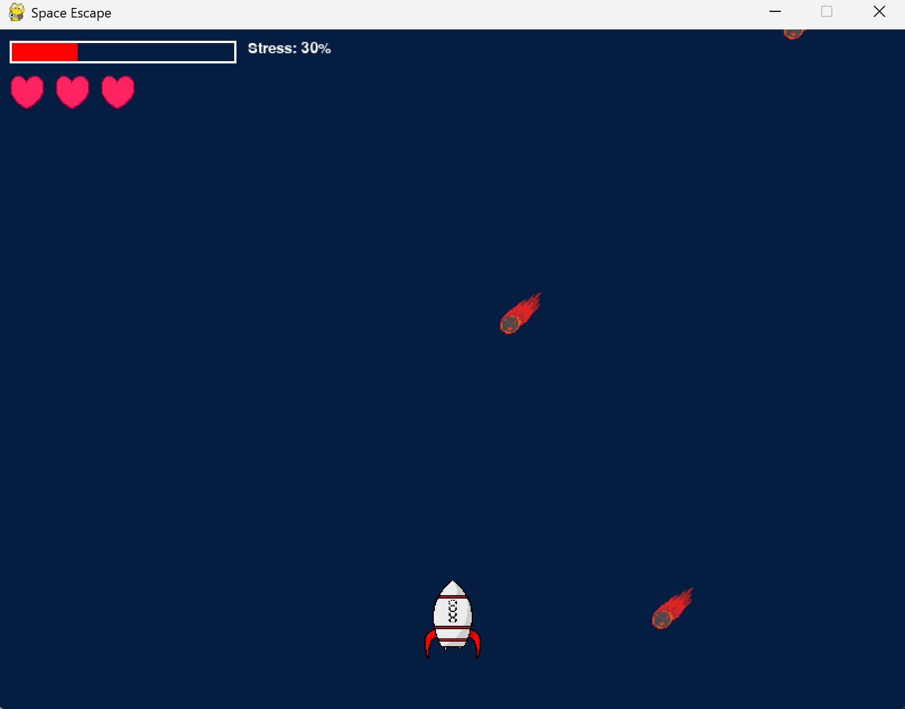

# 🚀 Space Escape

**Space Escape** est un jeu immersif où vous contrôlez une fusée à l’aide de capteurs physiologiques pour esquiver des météores et survivre dans l’espace. Utilisez vos muscles et votre respiration pour déplacer la fusée, tirer sur les obstacles et gérer le stress !
 
---

## 🎮 Contrôles

Le jeu utilise des **capteurs EMG** (électromyographie) pour détecter les mouvements des poignets, et un **capteur de respiration** pour mesurer le stress du joueur.

| Action                                 | Déclencheur                                 |
|----------------------------------------|---------------------------------------------|
| Déplacement vers la droite             | Serrer le poing droit (capteur EMG A1)      |
| Déplacement vers la gauche             | Serrer le poing gauche (capteur EMG A2)     |
| Tirer une balle vers l'avant           | Serrer les deux poings en même temps        |
| Augmentation de la vitesse des météores| Niveau de stress détecté via respiration (A3) |
 
---

## ⚙️ Configuration requise

- **Python 3.10** obligatoire
- Connexion Bluetooth active entre la carte de capteurs et l’ordinateur
- Ports capteurs :
    - EMG main droite → `A1`
    - EMG main gauche → `A2`
    - Capteur respiration → `A3`

---

## 🛠️ Installation

1. **Cloner le dépôt** :
   ```bash
   git clone https://github.com/Ibrahim-benzekri/Facteurs-humains.git
Installer les dépendances :

    pip install -r requirements.txt
Connecter la carte capteur via Bluetooth.

🚀 Lancement du jeu
 
Lancer le script principal :

    python stress.py
📌 Remarques

Assurez-vous que les capteurs sont bien positionnés et fonctionnels.

Plus vous êtes stressé (respiration rapide ou irrégulière), plus le jeu devient difficile !


📷 Aperçu


🧠 Auteur

Projet développé par :

    -Ibrahim BENZEKRI
    -Ahmed BOURAZZA  
    -Ikram EL HADI
